# AEON Bank Mobile Engineer Assessment

A React Native (Expo SDK 57) banking app in TypeScript: a list of latest transactions, a
transaction detail screen that can be shared externally as an image, and a balance derived
from the transaction ledger. State is managed with Zustand.

Written for the AEON Bank take-home assessment. See [Assessment coverage](#assessment-coverage)
for how each requirement maps onto the code, and [Beyond the brief](#beyond-the-brief) for the
extras.

## Screenshots

| Screen | English | Malay |
| --- | --- | --- |
| **Home** | 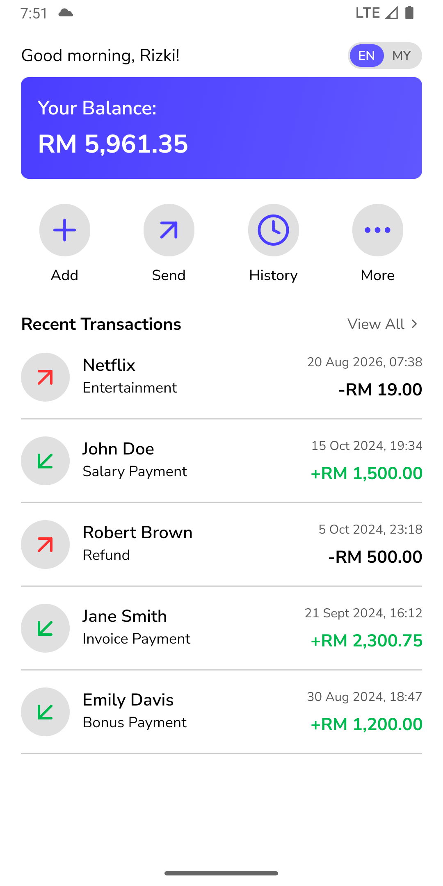 | 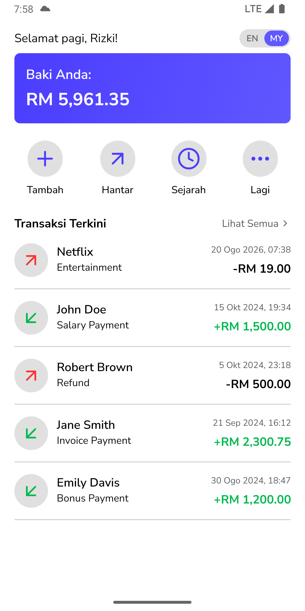 |
| **Transaction history** | 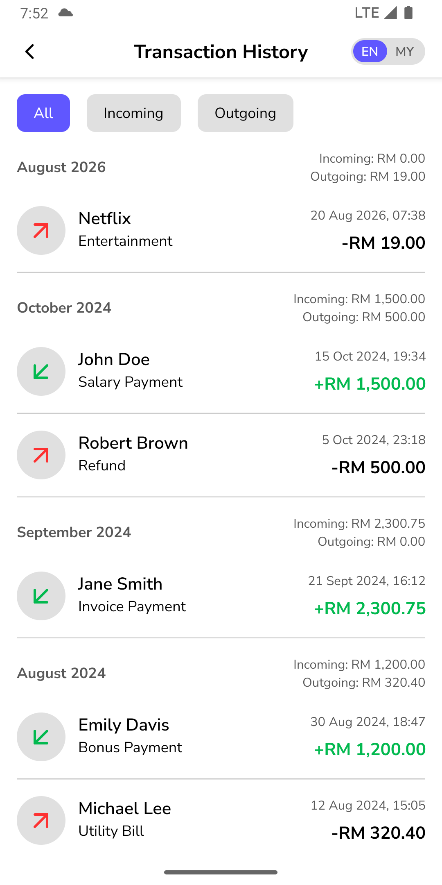 | 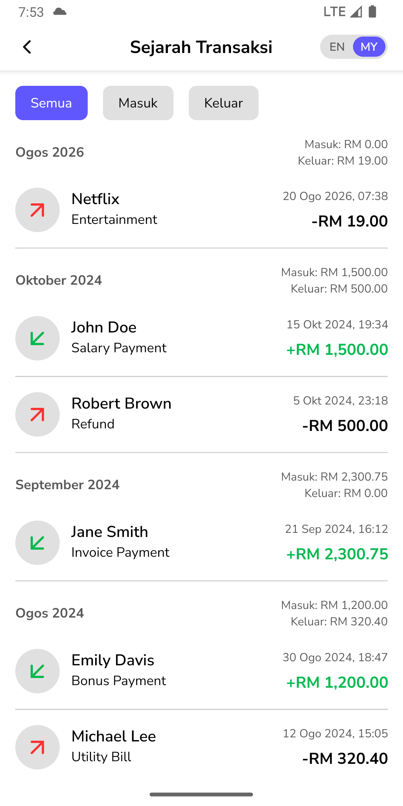 |
| **Transaction detail** | 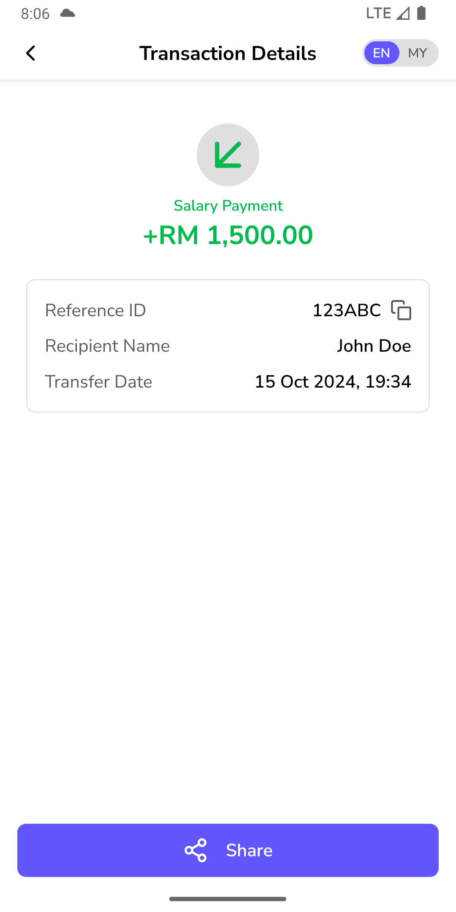 | 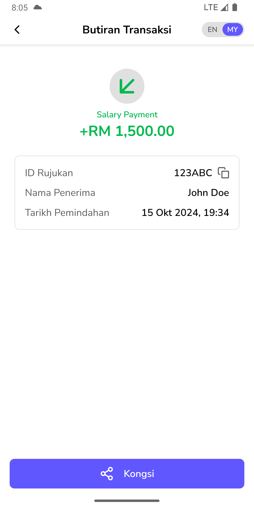 |
| **Share preview** |  | 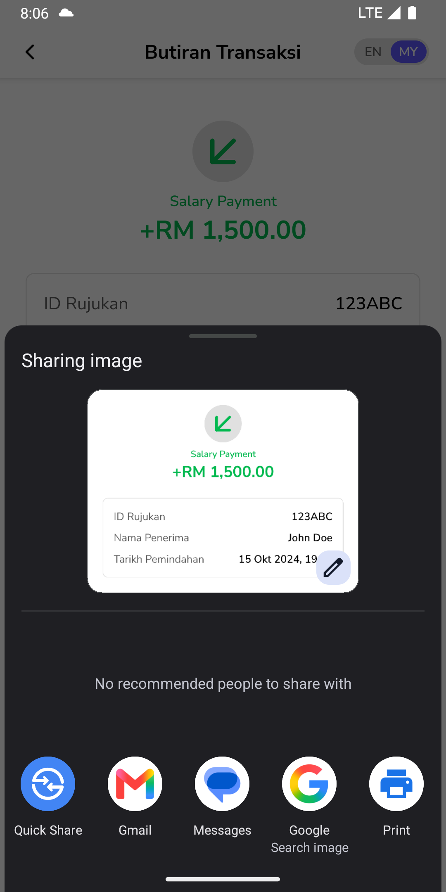 |
| **Add money** | 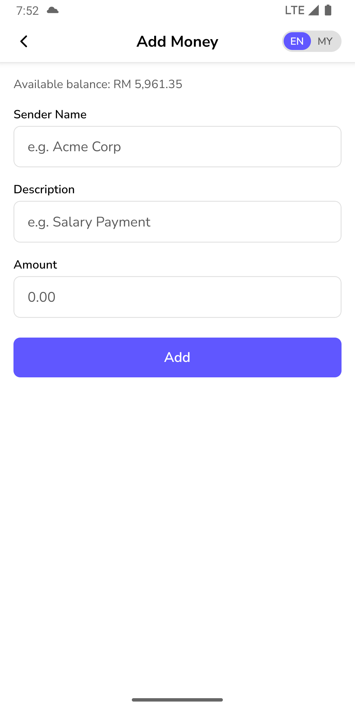 | 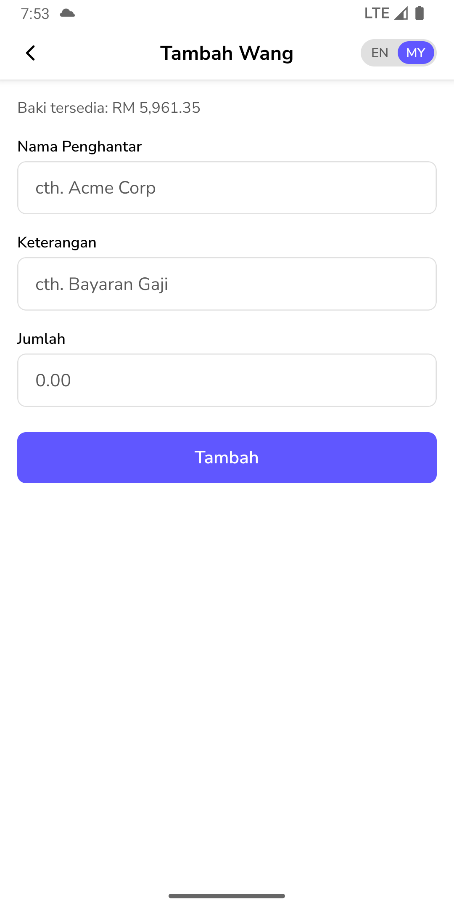 |
| **Send money** | 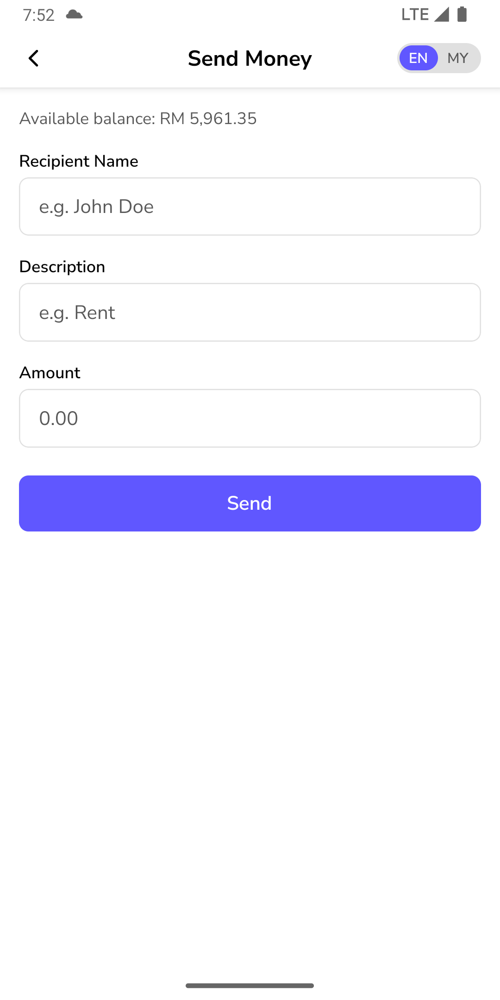 | 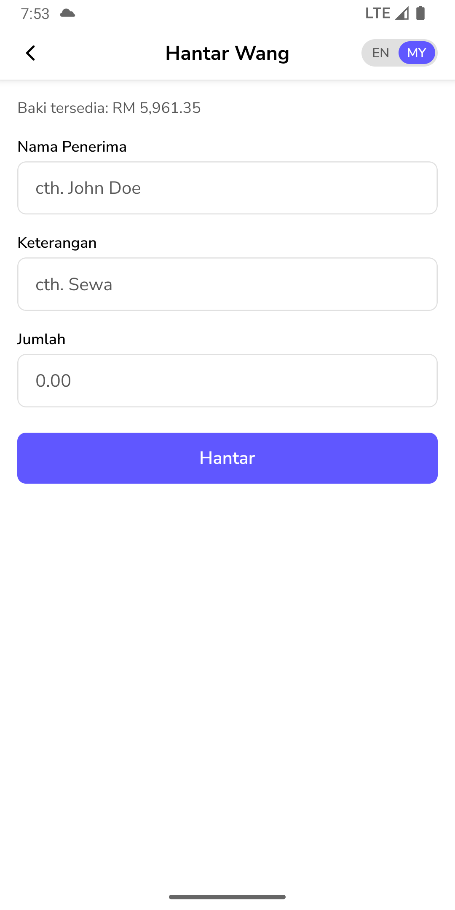 |

Captured on an Android emulator (API 34, 1080x2160) through Expo Go. The share preview is the
Android share sheet showing the image `react-native-view-shot` captured from the detail card.
Note that the copy button is absent, because `isCapturing` hides it while the shot is taken.

The add money and send money screens are not part of the assessment scope. They were added so
the ledger can be extended from the app instead of only reading seeded data. See
[Beyond the brief](#beyond-the-brief).

## Running the app

Prerequisites: Node 20+, and either the Expo Go app on a physical device or an Android
emulator / iOS simulator.

1. Install dependencies:

   ```bash
   npm install
   ```

2. Start the dev server:

   ```bash
   npx expo start
   ```

3. Open the app:
   - **Physical device**: scan the QR code from the terminal with Expo Go (Android) or the
     Camera app (iOS).
   - **Android emulator**: press `a` in the terminal, or run `npm run android`.
   - **iOS simulator**: press `i` in the terminal, or run `npm run ios` (macOS only).

No native build or `expo prebuild` is needed. The app runs in Expo Go as-is.

### Expo Go version

This project runs on Expo SDK 57, so it needs an **Expo Go build for SDK 57**. Expo Go supports
one SDK version at a time, and the build published on the Play Store or App Store can lag behind
(at the time of writing it is still on SDK 54, which will refuse to open this project).

Install the SDK 57 build from the official page instead, picking `SDK 57` in the SDK version
selector: [expo.dev/go](https://expo.dev/go). It offers builds for Android devices, iOS devices,
the Android emulator, and the iOS simulator.

For an emulator or simulator, `npx expo start` followed by `a` or `i` installs the matching Expo
Go build automatically, so no manual download is needed there.

### Other scripts

| Script | What it does |
| --- | --- |
| `npm run android` / `npm run ios` / `npm run web` | Start with a platform preselected |
| `npm test` | Run the Jest suite once |
| `npm run test:watch` | Run Jest in watch mode |
| `npm run lint` | ESLint via `expo lint` |
| `npx tsc --noEmit` | Type check |

## Android build and releases

A GitHub Actions workflow builds an installable Android APK:
[`.github/workflows/android-release.yml`](.github/workflows/android-release.yml).

- **Runs**: [Actions run history](https://github.com/rizbud/collabera-assessment/actions/workflows/android-release.yml)
- **Downloads**: [Releases page](https://github.com/rizbud/collabera-assessment/releases)

What it does, on a clean Ubuntu runner:

1. `npm ci` and `npm test`, so a failing suite fails the build.
2. `npx expo prebuild --platform android`, because the native project is generated from
   `app.json` rather than committed.
3. `./gradlew assembleRelease` in the generated `android` directory.
4. Uploads the APK as a build artifact, named after the tag or the short commit SHA.
5. Publishes a GitHub release with the APK attached when a tag is involved.

How to trigger it:

- **Tag push**: pushing a tag that starts with `v` builds and publishes a release under that
  tag, with generated release notes.

  ```bash
  git tag v1.0.0
  git push origin v1.0.0
  ```

- **Manual run**: start the workflow from the Actions tab. Leave the `tag` input empty to only
  get the APK as a build artifact, or pass a tag to publish a release as well.

## Tech stack

| Concern | Choice |
| --- | --- |
| Framework | Expo SDK 57, React Native 0.86, React 19 |
| Navigation | `expo-router` (file based, typed routes) |
| State | `zustand` with the `persist` middleware over AsyncStorage |
| Localization | `i18next` + `react-i18next`, seeded from `expo-localization` |
| Lists | `@shopify/flash-list` |
| Sharing | `react-native-view-shot` + `expo-sharing`, `expo-clipboard` |
| Testing | Jest (`jest-expo`) + `@testing-library/react-native` |

## Assessment coverage

| Requirement | Where |
| --- | --- |
| List of latest transactions, incoming and outgoing | [`(home)/index.tsx`](src/app/%28home%29/index.tsx) (5 newest) and [`transactions/index.tsx`](src/app/transactions/index.tsx) (full history) |
| Row shows transfer details, transfer date, amount | [`transaction-item.tsx`](src/components/transaction-item.tsx), with recipient and transfer name, formatted date, and a signed amount with a direction icon |
| Tapping a row navigates to the transaction detail | `router.push("/transactions/<refId>")` opens [`transactions/[ref-id].tsx`](src/app/transactions/%5Bref-id%5D.tsx) |
| Detail shows referenceId, date, recipient name, amount | [`transaction-details.tsx`](src/modules/transactions/components/transaction-details.tsx) |
| Share the detail page externally | The card is captured with `react-native-view-shot` and handed to the OS share sheet via `expo-sharing`, so any target the device offers works. See the share preview screenshot |
| React Native | Expo SDK 57, React Native 0.86 |
| TypeScript | Strict mode, no `any` in `src` |
| Zustand for state | [`transactions.store.ts`](src/store/transactions.store.ts), [`language.store.ts`](src/store/language.store.ts) |
| Documentation with steps to run | [Running the app](#running-the-app) |

The sample payload from the brief is the seed data in
[`src/constants/transactions.ts`](src/constants/transactions.ts), kept in the same shape
(`refId`, `transferDate`, `recipientName`, `transferName`, `amount`) with a couple of extra rows
so that month grouping and the incoming/outgoing filter have something to show. Negative
amounts are outgoing, exactly as in the brief's refund example.

## Beyond the brief

- **Month sections with running totals**: the history list groups by month and each header
  carries that month's incoming and outgoing totals, following the active filter.
- **Filtering**: All / Incoming / Outgoing, reset when the screen is left.
- **Money in and money out**: two form screens beyond the required scope that add to the
  ledger, with validation (required fields, positive amount, and no sending more than the
  balance) and navigation straight to the new transaction's detail screen.
- **Balance derived from the ledger**: no separately stored number that can drift.
- **Localization**: full English and Malay with an in-app switch on every screen. Dates follow
  the language, currency stays MYR.
- **Persistence**: transactions and the language choice survive a restart (AsyncStorage).
- **Accessibility**: every control has an accessibility role and label, selectable controls
  report their selected state, and a list row reads as one sentence ("Incoming transaction
  Salary Payment of RM 1,500.00 from John Doe on 15 Oct 2024, 19:34").
- **Tests**: 132 Jest tests covering utils, stores, hooks, components and screens.
- **Copy to clipboard**: the reference ID can be copied, and the button is kept out of the
  shared image.

## Project structure

```
src/
├── app/                      # expo-router routes (the only place screens live)
│   ├── _layout.tsx           # fonts, splash, i18n + language store bootstrap, Stack
│   ├── (home)/index.tsx      # balance card, actions, recent transactions
│   └── transactions/
│       ├── index.tsx         # history: filters + month-grouped list
│       ├── [ref-id].tsx      # detail for one transaction
│       ├── add.tsx           # money in
│       └── send.tsx          # money out
├── components/               # shared across features (transaction item, header, switcher)
├── constants/                # theme, seeded transactions
├── i18n/
│   ├── index.ts              # i18next init, deviceLanguage, dateLocale
│   ├── hooks/useI18n.ts      # the only translation entry point for components
│   └── locales/              # en.json, ms.json + LANGUAGES / isLanguage / resources
├── modules/                  # feature slices: components, hooks, constants
│   ├── home/
│   └── transactions/
├── store/                    # zustand stores
├── types/                    # shared types
└── utils/                    # pure helpers (formatting, transaction math)
```

Feature specific pieces live under `modules/<feature>/`. Anything used by more than one
feature is promoted to the top level `components/`, `utils/`, or `constants/`.

## Architecture notes

### Transactions store

[`src/store/transactions.store.ts`](src/store/transactions.store.ts) is the single source of
truth for the ledger. It holds the transactions, the active history filter, and one action:

```ts
addTransaction(transaction: NewTransaction): Transaction
```

`refId` and `transferDate` are stamped by the store, and the created transaction is returned so
the caller can navigate straight to its detail screen. Transactions are persisted to
AsyncStorage. The filter is deliberately left out of `partialize`, because it is screen state
rather than data, and it is reset when the history screen unmounts.

Everything derived from the ledger is a pure function in
[`src/utils/transactions.ts`](src/utils/transactions.ts) rather than stored state:

- `calculateBalance`: the balance shown on the home card and in the forms.
- `sortByDateDesc` and `filterTransactions`: ordering and the all/in/out filter.
- `groupByMonth`: flattens transactions into `TransactionRow[]`, inserting a
  `TransactionMonthHeader` before each month with that month's incoming and outgoing totals.

Sign convention: one signed `amount` per transaction, where positive is incoming, negative is
outgoing, and `0` counts as incoming. Month totals expose `outgoing` as a positive magnitude
for display.

### One list, two row types

The history screen renders a single `FlashList` over `TransactionRow[]`, where a row is either
a month header or a transaction. `isMonthHeader` narrows the union, and `getItemType` keeps
FlashList's recycling correct across the two shapes. Month totals follow the active filter
because they are computed from the rows that were passed in, so filtering to Outgoing makes
every `Incoming` line read `RM 0.00`.

### Localization

`useI18n`, a thin wrapper over `useTranslation`, is the only translation entry point in
components, and `t` is never imported from `react-i18next` directly. Non-component code
(`utils/clipboard.ts` and the share hook) uses the `i18n` instance.

- Static UI is translated, including every accessibility label. Transaction data is not.
- Dates follow the language via `dateLocale(language)`, which resolves to `en-MY` or `ms-MY`.
  Components pass `currentLanguage` into `formatDatetime` and `formatMonthYear` explicitly,
  because reading the active language inside the helper is an untracked dependency, and React
  Compiler (enabled in `app.json`) then caches the formatted string across a language change.
- Currency deliberately does not follow the language. `formatCurrency` stays on `ms-MY` MYR in
  both languages.
- The greeting helper returns a translation *key* (`greetingKey()`), resolved by the component,
  so it re-renders on a language change instead of freezing the string it was built with.
- Two memos take the current language as a dependency, the grouped history rows and the
  recent-transactions slice, because their contents are formatted strings and FlashList will
  not re-render rows for an unchanged array.

The picked language is persisted by
[`src/store/language.store.ts`](src/store/language.store.ts). Since `useI18n.changeLanguage`
talks to i18next directly, the store also mirrors i18next's `languageChanged` event, so the
choice survives a restart no matter which path changed it.

## Testing

```bash
npm test
```

25 suites and 132 tests covering utils, both stores, all hooks, every component, and every
screen, at 100% of statements on `src`.

Notes for anyone extending the suite:

- `@testing-library/react-native` v14 is **async**, so use `await render(...)`,
  `await renderHook(...)`, `await userEvent.press(...)`, and `await unmount()`.
- Shared mocks live in [`jest.setup.ts`](jest.setup.ts) for AsyncStorage, expo-localization,
  clipboard, sharing, expo-router, view-shot, and safe-area-context (the real provider never
  renders children without a layout pass).
- Currency assertions have to allow for the non-breaking space Intl puts after `RM`.
- Jest replaces FlashList with React Native's FlatList to avoid FlashList's internal layout timers;
  recycling behavior still needs a device or emulator test.

## Known limitations

- Transactions are seeded from
  [`src/constants/transactions.ts`](src/constants/transactions.ts) and there is no backend.
  `addTransaction` is the seam where a real API call would go.
- `refId` is generated with `Math.random().toString(36)`, which is fine for mock data but not
  collision-proof.
- The **More** action on the home screen is a placeholder.
- Language rehydration is async, so a launch with a saved non-default language can show one
  frame in the previous language.
